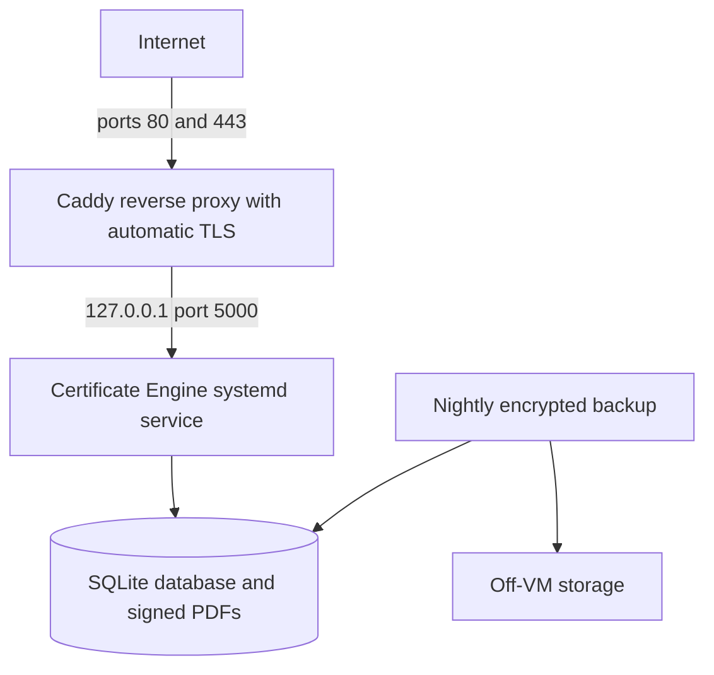

# Hosting

The reference deployment is intentionally simple: **one small Linux VM**, the app running as a systemd service bound only to localhost, and Caddy as the sole thing exposed to the internet, handling TLS automatically. No container orchestration, load balancer, or managed database is required.



## 1. Provision the VM

- Any small Linux VM is enough for typical NGO event volumes — 1–2 vCPUs and 1–2 GB RAM is plenty. Ubuntu 22.04/24.04 LTS or Debian 12 are good defaults.
- Point DNS at it before you need TLS: create an `A` record (and `AAAA` if you have an IPv6 address) for your verification hostname, e.g. `verify.yourdomain.org`, pointing at the VM's public IP. Let's Encrypt (via Caddy) needs this to already resolve correctly when it requests a certificate.
- **ARM note:** if the VM is ARM-based (e.g. AWS Graviton, Oracle Ampere, or similar), publish with `-r linux-arm64` instead of `-r linux-x64` in step 4 below — everything else is identical.

## 2. Create a dedicated service user

Run the app as an unprivileged system account with no login shell, never as root or your own SSH user:

```
sudo adduser --system --group --no-create-home --shell /usr/sbin/nologin certeng
```

## 3. Create directories

```
sudo mkdir -p /opt/certificate-engine/data
sudo mkdir -p /etc/certificate-engine
sudo chown -R certeng:certeng /opt/certificate-engine
sudo chmod 750 /opt/certificate-engine
sudo chmod 700 /etc/certificate-engine
```

- `/opt/certificate-engine` — the published app binary plus `data/` (the `Platform:DataDirectory` — SQLite database, signed PDFs, and optionally the CA material if you choose to keep it on-box).
- `/etc/certificate-engine` — holds `secrets.env`, referenced by the systemd unit's `EnvironmentFile`, and optionally the Google service-account JSON key.

## 4. Publish and copy the app

Build a self-contained, single-file publish (no separate .NET runtime install needed on the VM) from your dev machine or CI:

```
dotnet publish src/CertificateEngine -c Release -r linux-x64 --self-contained true -p:PublishSingleFile=true -o ./publish
```

(Use `-r linux-arm64` instead if the VM is ARM-based — see step 1.)

Copy the contents of `./publish` to the server, e.g.:

```
rsync -avz ./publish/ your-user@your-vm:/opt/certificate-engine/
```

Then, on the server:

```
sudo chown -R certeng:certeng /opt/certificate-engine
sudo chmod +x /opt/certificate-engine/CertificateEngine
```

Also copy over whatever the app needs at runtime that isn't part of the publish output: `signing.pfx` and `root-ca.pem` from the CA tool (see [`docs/signing-key-and-ca.md`](signing-key-and-ca.md)), and the Google service-account JSON key (see [`docs/google-setup.md`](google-setup.md)) if you're using `ServiceAccountJsonPath` rather than an inline environment variable.

## 5. Configure secrets

Create `/etc/certificate-engine/secrets.env` (referenced by the systemd unit below), owned by `certeng` and not world-readable:

```
sudo touch /etc/certificate-engine/secrets.env
sudo chown certeng:certeng /etc/certificate-engine/secrets.env
sudo chmod 600 /etc/certificate-engine/secrets.env
```

with contents like:

```
Platform__InternalApiKey=replace-with-a-long-random-value
GoogleSheets__ServiceAccountJsonPath=/etc/certificate-engine/service-account.json
Smtp__Password=replace-with-your-resend-api-key
WhatsApp__AccessToken=replace-with-your-meta-access-token
Signing__PfxPassword=replace-with-your-signing-pfx-password
```

(Recall the `Section__Key` double-underscore convention maps to configuration key `Section:Key` — e.g. `Smtp__Password` sets `Smtp:Password`.) Anything non-secret can instead go in `/opt/certificate-engine/appsettings.Production.json`.

For Resend SMTP, the application uses `smtp.resend.com` on port `465` with username `resend`. Keep `Smtp__Password` in this protected environment file (or an equivalent secret manager); it is the Resend API key and must never be committed or logged. Set `Smtp__FromAddress` to a Resend-verified sender for production. The development sender `onboarding@resend.dev` is configured by default.

## 6. Install the systemd service

```
sudo cp deploy/systemd/certificate-engine.service /etc/systemd/system/
sudo systemctl daemon-reload
sudo systemctl enable --now certificate-engine
sudo systemctl status certificate-engine
```

The unit ([`deploy/systemd/certificate-engine.service`](../deploy/systemd/certificate-engine.service)) binds the app to `127.0.0.1:5000` only, runs it as the `certeng` user, restarts it automatically on failure, and applies several systemd sandboxing directives (`ProtectSystem=strict`, `NoNewPrivileges`, an empty `CapabilityBoundingSet`, etc.) — see the file itself and [`docs/signing-key-and-ca.md`](signing-key-and-ca.md#optional-hardening-ideas-for-later) for the reasoning.

Useful operational commands:

```
sudo journalctl -u certificate-engine -f      # tail logs
sudo systemctl restart certificate-engine     # restart after a config/binary change
```

## 7. Install and configure Caddy

Install Caddy following [Caddy's official instructions](https://caddyserver.com/docs/install) for your distro, then:

```
sudo cp deploy/caddy/Caddyfile /etc/caddy/Caddyfile
```

Edit `/etc/caddy/Caddyfile` and replace the placeholder domain `verify.yourdomain.org` with your real verification hostname, then:

```
sudo systemctl reload caddy
```

Caddy automatically requests (and renews) a Let's Encrypt certificate the first time it sees a request for the configured hostname — this requires DNS to already be pointing at the VM and ports 80/443 reachable from the internet (step 8).

The reference [`deploy/caddy/Caddyfile`](../deploy/caddy/Caddyfile) deliberately returns 404 for `/internal/*` so the internal API is never reachable from the public internet through the reverse proxy, even though it shares a port with the public verification page inside the app itself. To reach `/internal/*` day to day, either run `curl` directly on the VM (e.g. over SSH), or tunnel it: `ssh -L 5000:127.0.0.1:5000 your-user@your-vm`, then `curl http://127.0.0.1:5000/internal/health` from your own machine. If you choose to enable the optional Apps Script push described in [`docs/google-setup.md`](google-setup.md#9-optional-apps-script-push-for-lower-latency), you'll need to deliberately add a narrow exception for just the `poll-now` route.

## 8. Firewall

Only 80/443 should be reachable from the internet; restrict SSH to a known IP, or skip exposing SSH entirely in favor of your provider's browser-based shell:

```
sudo ufw default deny incoming
sudo ufw default allow outgoing
sudo ufw allow 80/tcp
sudo ufw allow 443/tcp
sudo ufw allow from <your-known-ip> to any port 22 proto tcp
sudo ufw enable
```

## 9. Backups

Back up, at minimum:

- The SQLite database file(s) under `Platform:DataDirectory` (default `data/`).
- Every signed PDF stored alongside it in that same directory.
- `signing.pfx` (if you don't already keep your only copy of it elsewhere — see [`docs/signing-key-and-ca.md`](signing-key-and-ca.md)).

`root-ca.pfx` should not be on the VM at all in normal operation (see [`docs/signing-key-and-ca.md`](signing-key-and-ca.md)), so it isn't part of the nightly backup — it lives in cold storage instead.

Encrypt backups before they leave the VM. For a consistent database snapshot while the service keeps running, prefer SQLite's own `.backup` command over copying the `.db` file directly with `cp`. For example, a nightly cron job:

```
0 2 * * * root sqlite3 /opt/certificate-engine/data/certificate-engine.db ".backup /var/backups/certificate-engine/db-$(date +\%F).db" && tar -czf - -C /var/backups/certificate-engine db-$(date +\%F).db -C /opt/certificate-engine/data . | gpg --symmetric --cipher-algo AES256 --batch --passphrase-file /root/.backup-passphrase -o /var/backups/certificate-engine/backup-$(date +\%F).tar.gz.gpg
```

(Adjust the database filename to whatever the engine actually creates under `data/`.) Push the resulting encrypted archive somewhere off-VM — object storage, a separate backup host, etc. — and periodically test that you can actually restore from it. A backup that's never been restored isn't a backup.

## 10. Checklist

- [ ] DNS `A`/`AAAA` record for the verification hostname points at the VM
- [ ] `certeng` service user created, no login shell
- [ ] App published self-contained for the correct architecture (`linux-x64` or `linux-arm64`) and copied to `/opt/certificate-engine`
- [ ] `signing.pfx` / `root-ca.pem` / service-account JSON in place, readable only by `certeng`
- [ ] `/etc/certificate-engine/secrets.env` populated, mode 600
- [ ] `certificate-engine.service` installed, enabled, running
- [ ] Caddy installed, `Caddyfile` domain updated, reloaded, certificate issued
- [ ] Firewall allows only 80/443 (+ restricted SSH)
- [ ] Nightly encrypted off-VM backup configured and test-restored at least once
